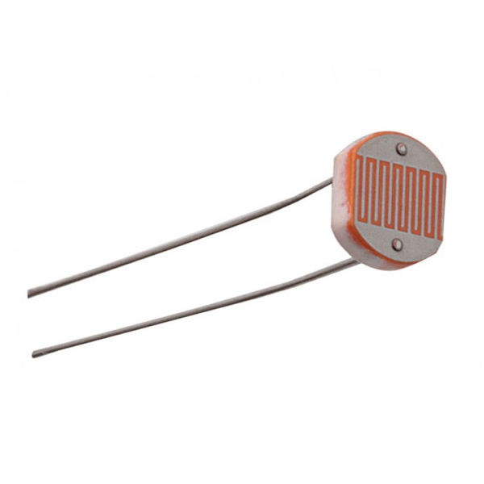
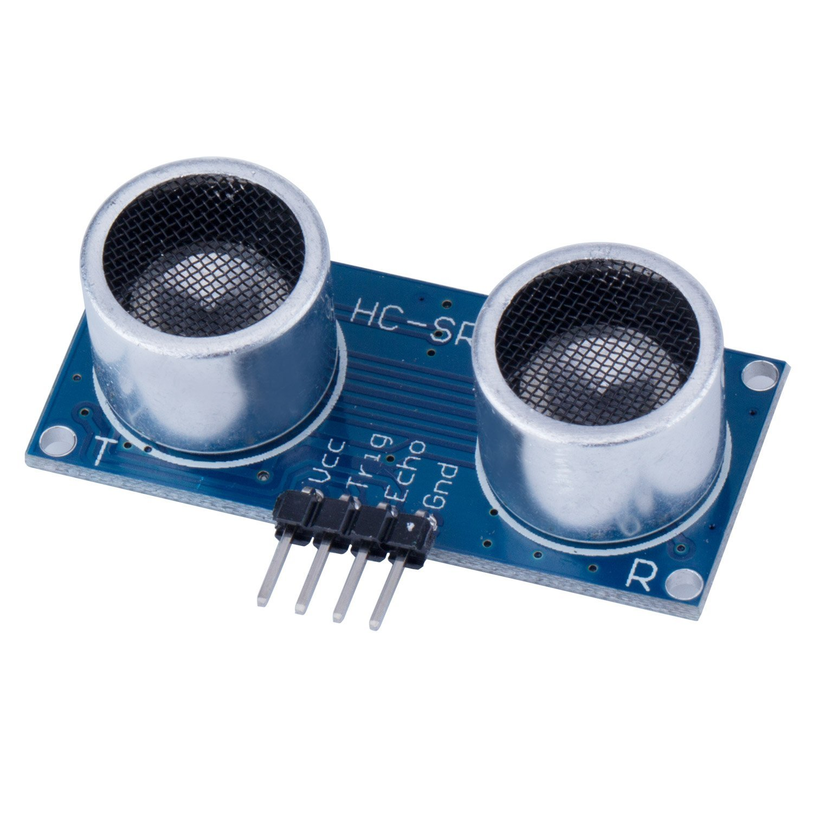
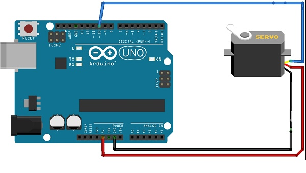

# Arduino & Sensors


### Software Requirements
1. [Arduino IDE](https://www.arduino.cc/en/Main/Software)
		
### Hardware Requirements
1. Arduino Uno
2. LED
3. DHT 11 (Sensor Suhu)
4. LDR (Sensor cahaya)
5. HC-SR04 (Sensor Jarak)
6. PIR (Sensor Gerakan)
7. IR Receiver
8. Servo
		
## A. Dasar Teori
### 1. Arduino


Arduino adalah sebuah mikrokontroller board tunggal yang memiliki sifat terbuka (open source) yang diturunkan dari platform berbasis Wiring. Pengendali ini dirancang untuk mempermudah penggunaan dalam berbagai bidang elektronik. Hardware arduino mengandung prosesor jenis Atmel AVR, dan memiliki bahasa pemrograman tersendiri (mirip bahasa C). 

### 2. LED


Light Emitting Diode atau sering disingkat dengan LED adalah komponen elektronika yang dapat memancarkan cahaya monokromatik ketika diberikan tegangan DC. LED merupakan keluarga Dioda yang terbuat dari bahan semikonduktor. Warna-warna Cahaya yang dipancarkan oleh LED tergantung pada jenis bahan semikonduktor yang dipergunakannya. 

### 3. DHT 11 (Sensor Suhu & kelembapan)


DHT11 adalah salah satu sensor yang dapat mengukur dua parameter lingkungan sekaligus, yakni suhu dan kelembaban udara (humidity). Dalam sensor ini terdapat sebuah thermistor tipe NTC (Negative Temperature Coefficient) untuk mengukur suhu, sebuah sensor kelembaban tipe resisitif dan sebuah mikrokontroller 8-bit yang mengolah kedua sensor tersebut dan mengirim hasilnya ke pin output dengan format single-wire bi-directional (kabel tunggal dua arah).

### 4. LDR (Sensor cahaya)



Light Dependent Resistor atau disingkat dengan LDR adalah jenis Resistor yang nilai hambatan atau nilai resistansinya tergantung pada intensitas cahaya yang diterimanya. Nilai Hambatan LDR akan menurun pada saat cahaya terang dan nilai Hambatannya akan menjadi tinggi jika dalam kondisi gelap. Dengan kata lain, fungsi LDR (Light Dependent Resistor) adalah untuk menghantarkan arus listrik jika menerima sejumlah intensitas cahaya (Kondisi Terang) dan menghambat arus listrik dalam kondisi gelap.

### 5. HC-SR04 (Sensor Jarak)



HC-SR04 adalah sensor pengukur jarak berbasis gelombang ultrasonik. Prinsip kerja sesnsor ini pirip dengan radar ultrasonik. Gelombang ultrasonik di pancarkan kemudian di terima balik oleh receiver ultrasonik. Jarak antara waktu pancar dan waktu terima adalah representasi dari jarak objek. Sensor ini cocok untuk aplikasi elektronik yang memerlukan deteksi jarak termasuk untuk sensor pada robot.

### 6. PIR (Sensor Gerakan)


PIR (Passive Infrared Receiver) merupakan sebuah sensor berbasiskan infrared. Akan tetapi, tidak seperti sensor infrared kebanyakan yang terdiri dari IR LED dan fototransistor. PIR tidak memancarkan apapun seperti IR LED. Sesuai dengan namanya ‘Passive’, sensor ini hanya merespon energi dari pancaran sinar inframerah pasif yang dimiliki oleh setiap benda yang terdeteksi olehnya. Benda yang bisa dideteksi oleh sensor ini biasanya adalah tubuh manusia.

### 7. IR Sensor


Infra red (IR) detektor atau sensor infra merah adalah komponen elektronika yang dapat mengidentifikasi cahaya infra merah (infra red, IR). Sensor infra merah atau detektor infra merah saat ini ada yang dibuat khusus dalam satu modul dan dinamakan sebagai IR Detector Photomodules. IR Detector Photomodules merupakan sebuah chip detektor inframerah digital yang di dalamnya terdapat fotodiode dan penguat (amplifier).


### 8. Servo


Motor servo adalah sebuah motor DC dengan sistem umpan balik tertutup di mana posisi rotor-nya akan diinformasikan kembali ke rangkaian kontrol yang ada di dalam motor servo. Motor ini terdiri dari sebuah motor DC, serangkaian gear, potensiometer, dan rangkaian kontrol. Potensiometer berfungsi untuk menentukan batas sudut dari putaran servo. Sedangkan sudut dari sumbu motor servo diatur berdasarkan lebar pulsa yang dikirim melalui kaki sinyal dari kabel motor servo.


## B. Cara Bermain

### 1. LED

Circuit LED : 


Sketch LED:

```C

int ledPin = 13;                // definisikan digital pin 13 sebagai LED

void setup()
{
  pinMode(ledPin, OUTPUT);      // set digital pin 13 sebagai output
}

void loop()
{
  digitalWrite(ledPin, HIGH);   // sets kondisi LED menyala
  delay(1000);                  // delay 1 detik
  digitalWrite(ledPin, LOW);    // sets kondisi LED mati
  delay(1000);                  // delay 1 detik
}
```


### 2. DHT 11

Circuit DHT 11


Sketch DHT 11

```C
#include "DHT.h"
#define pinDHT  2
#define tipeDHT DHT11
 
DHT sensorDHT(pinDHT, tipeDHT);
float h, t;
 
void setup() {
  
  Serial.begin(9600);
  Serial.println("Percobaan Sensor DHT11!");
  Serial.println("Inisialisasi");
 
  for(int i = 0; i < 10; i++){
    Serial.print("==");
    delay(500);
  }
 
  Serial.println();
  Serial.println("Mulai!");
  delay(2000);
}
 
void loop() {
  
  
  float h = sensorDHT.readHumidity();
  
  float t = sensorDHT.readTemperature();
 
  if (isnan(h) || isnan(t)) {
    Serial.println("Pembacaan Sensor DHT11 Gagal!");
    return;
  }
 
  Serial.print("Kelembaban Udara : ");
  Serial.print(h);
  Serial.println(" %");
 
  Serial.print("Suhu Udara : ");
  Serial.print(t);
  Serial.println(" C");
  delay(500);
}
```

### 3. LDR

Circuit LDR


Sketch LDR
```C
int LDR_Pin = A0; //analog pin 0

void setup(){
Serial.begin(9600);
}

void loop(){
int LDRReading = analogRead(LDR_Pin);

Serial.println(LDRReading);
delay(250); 
}
```

### 4. HC-SR04

[Download Library](https://bitbucket.org/teckel12/arduino-new-ping/downloads/)

Circuit HC-SR04


Sketch HC-SR04

```C
// ---------------------------------------------------------------------------
// contoh program ukur jarak dg sensor ultrasonik
// saptaji.com 
//---------------------------------------------------------------------------

#include <NewPing.h>

#define TRIGGER_PIN  12  // jumper pin TRIG sensor ke pin 12 arduino
#define ECHO_PIN     11  // jumper pin ECHO sensor ke pin 11 arduino
#define MAX_DISTANCE 200 // jarak maks (cm).

NewPing sonar(TRIGGER_PIN, ECHO_PIN, MAX_DISTANCE); // bikin class baru

void setup() {
  Serial.begin(9600); // buka serial monitor dg  br 9600
}

void loop() {
  delay(50);                      // delay tiap pengukuran (bisa diset sdr)
  unsigned int uS = sonar.ping(); // kirim ping dan simpan hasilnya di variabel uS (satuannya mikrodetik)
  Serial.print("Ping: "); //kirim tulisan 'Ping' ke serial monitor
  Serial.print(uS / US_ROUNDTRIP_CM); // konversi pingtime ke jarak (cm)
  Serial.println("cm");   //kirim tulisan 'cm' ke serial monitor
  delay (1000);
}
```

### 5. PIR Sensor

Circuit PIR Sensor


Sketch PIR Sensor

```C
int pirPin = 8;
int val;

void setup() {
  Serial.begin(9600);
}

void loop() {
  val = digitalRead(pirPin); //baca status PIR
  
  if (val == LOW) {
    Serial.println("No motion"); //jika tidak ada gerakan
  }
  else {
    Serial.println("Motion!"); //jika ada gerakan
  }
  
  delay(1000);
}
```

### 6. IR sensor

[Download Library](http://z3t0.github.io/Arduino-IRremote/)

Circuit IR Sensor


Sketch IR Sensor

```C
#include <IRremote.h>

const int RECV_PIN = 7;
IRrecv irrecv(RECV_PIN);
decode_results results;

void setup(){
  Serial.begin(9600);
  irrecv.enableIRIn();
  irrecv.blink13(true);
}

void loop(){
  if (irrecv.decode(&results)){
        Serial.println(results.value, HEX);
        irrecv.resume();
  }
}
```

### 7. Servo

[Download Library](http://z3t0.github.io/Arduino-IRremote/)

Circuit Servo



Sketch Servo

```C
#include <Servo.h>

Servo myservo;

void setup()
{
	myservo.attach(10);
}

void loop()
{
	myservo.write(0);
	delay(1000);
	myservo.write(90);
	delay(1000);
	myservo.write(180);
	delay(1000);
	myservo.write(90);
	delay(1000);
}
```

## C. Waktunya Bereksperimen !