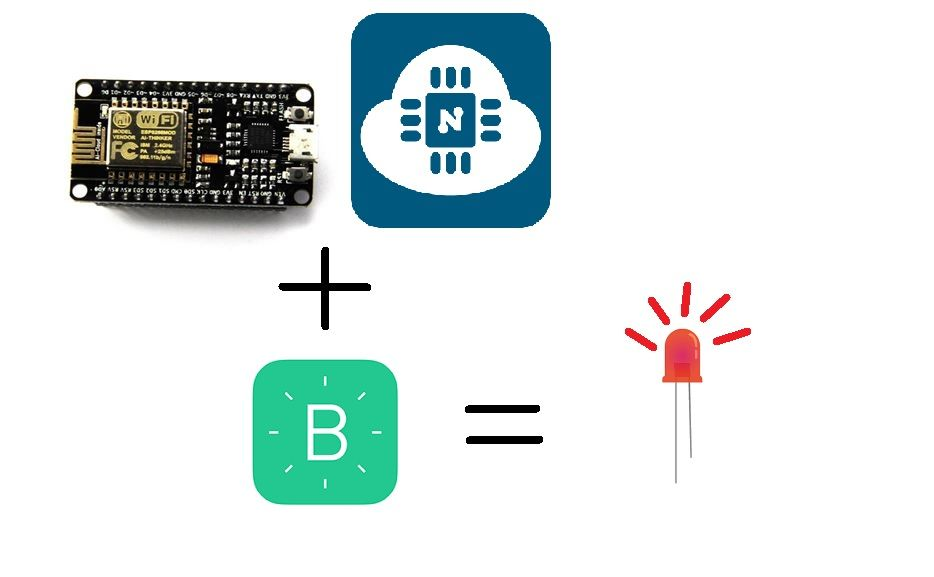
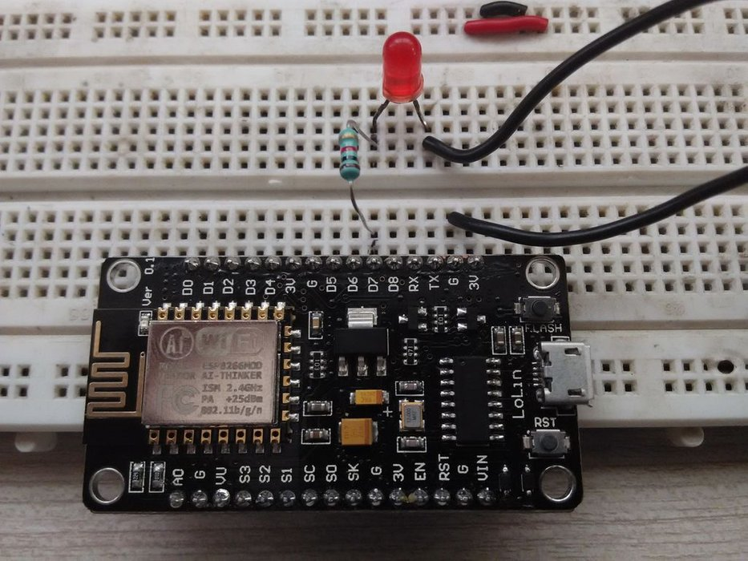

# NodeMCU & Blynk




### Software Requirements:

1. Arduino IDE
2. Blynk App

### Hardware Requirements

1. NodeMCU
2. Smartphone
3. Laptop

## A. Dasar Teori

#### 1. NodeMCU

Secara fungsi NodeMCU ini hampir menyerupai platform modul arduino, tetapi yang membedakan arduino dengan NodeMCU ini adalah NodeMCU dibuat memang dikhususkan untuk "connected to internet". Oleh sebab itu NodeMCU memiliki built-in Wi-Fi.

#### 2. Blynk

Aplikasi pada IoS ataupun Android yang memungkinkan untuk mengendalikan Arduino, Rasberry Pi, dan sejenisnya melalui internet.

## B. Cara Bermain

---

1. Tambah Library Blynk (https://github.com/blynkkk/blynk-library/releases/tag/v0.5.1)

2. Tambah additional Board Manager (http://arduino.esp8266.com/versions/2.4.1/package\_esp8266com\_index.json)

3. Buat rangkaian seperti gambar berikut.

4. Buka Aplikasi Blynk di Smartphone dan buat new project.

5. Buat button dan ubah pin nya menjadi Digital GP13.


6. Buka File -&gt; Examples -&gt; Blynk -&gt; BoardsWiFi -&gt; ESP8266\_Standalone

7. Ubah Auth sesuai token blynk, ssid sesuai nama wifi yang digunakan, dan pass sesai dengan password wifi.

```
// You should get Auth Token in the Blynk App.
// Go to the Project Settings (nut icon).
char auth[] = "(ISI DENGAN TOKEN BLINK)";

// Your WiFi credentials.
// Set password to "" for open networks.
char ssid[] = "(NAMA WIFI)";
char pass[] = "(PASSWORD WIFI)";
```
